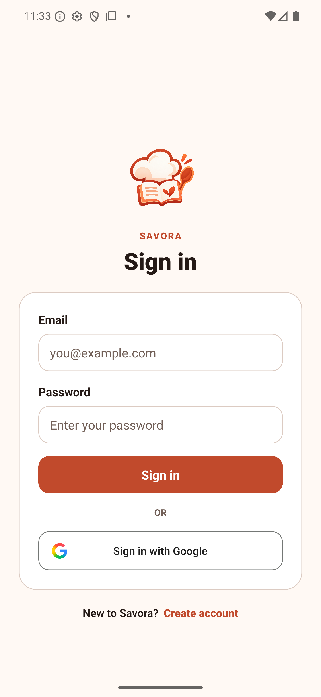
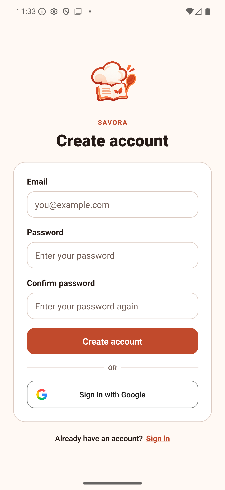
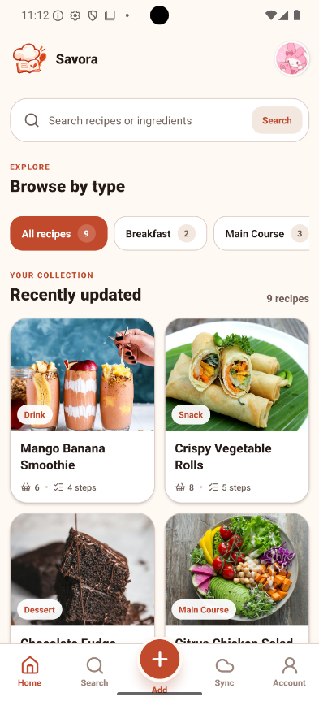
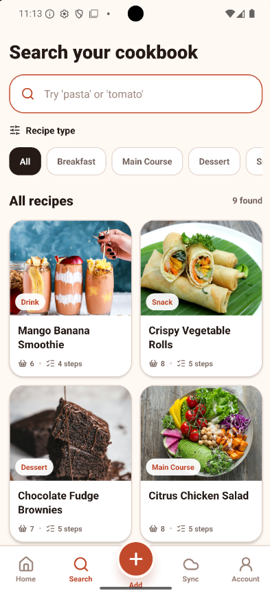
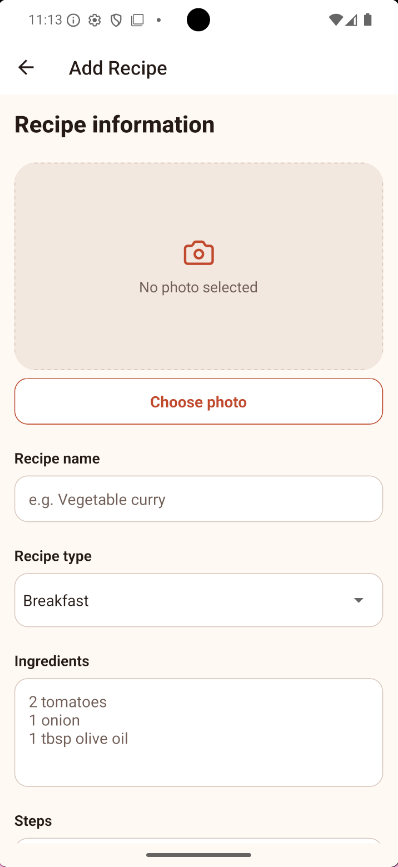
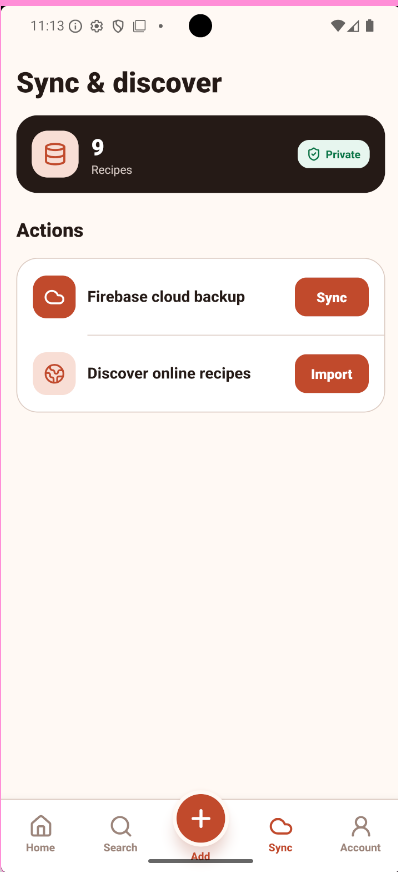
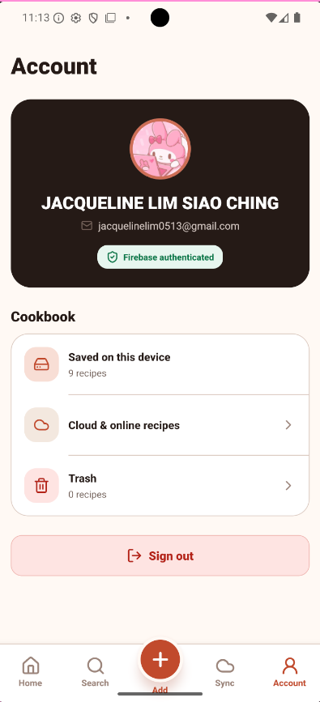

# Savora

Savora is a React Native CLI application built for the Fortitude Asia Recipe App hands-on test. It supports Firebase-authenticated access, cloud recipe sync, online recipe discovery, and complete local recipe management on iOS and Android.

## Interface tour

Savora begins with Firebase authentication and then uses a consistent five-item bottom navigation bar. Home, Search, Sync, and Account open the app's main areas, while the raised centre button provides quick access to the Add Recipe form.

<table>
  <tr>
    <td width="50%" valign="top">
      
      <br /><strong>Sign In</strong><br />Sign in with a Firebase email and password account or continue with Google. The underlined Create account link switches to registration without leaving the authentication flow.
    </td>
    <td width="50%" valign="top">
      
      <br /><strong>Create Account</strong><br />Register with an email address, password, and password confirmation. Validation catches mismatched passwords, Google Sign-In is also available, and the underlined Sign in link returns to existing-account access.
    </td>
  </tr>
  <tr>
    <td width="50%" valign="top">
      
      <br /><strong>Home</strong><br />Browse the cookbook, filter recipes by type, open recipe details, or jump directly to search. Recipe cards show a photo, category, title, ingredient count, and step count.
    </td>
    <td width="50%" valign="top">
      
      <br /><strong>Search</strong><br />Find recipes by recipe name or ingredient. Type chips narrow the results to categories such as Breakfast, Main Course, Dessert, Snack, and Drink.
    </td>
  </tr>
  <tr>
    <td width="50%" valign="top">
      
      <br /><strong>Add Recipe</strong><br />Create a recipe with a selected photo, recipe name, type, ingredients, and ordered preparation steps. The same form is reused when editing an existing recipe.
    </td>
    <td width="50%" valign="top">
      
      <br /><strong>Sync &amp; Discover</strong><br />Back up and merge the signed-in user's private recipes with Firebase, or import additional recipe ideas from the online catalogue without duplicating existing imports.
    </td>
  </tr>
  <tr>
    <td width="50%" valign="top">
      
      <br /><strong>Account</strong><br />View the authenticated profile, local recipe count, cloud tools, and Trash. Recipes in Trash can be restored or permanently deleted before signing out.
    </td>
    <td width="50%" valign="top">
      <strong>Responsive and accessible</strong><br />The interface respects safe areas, supports phone and tablet widths, uses labelled controls and readable contrast, and keeps destructive actions behind confirmation dialogs.
    </td>
  </tr>
</table>

## Requirements covered

- TypeScript and React Native CLI
- Recipe types loaded from `src/data/recipetypes.json`
- Pre-populated sample recipes
- Recipe type filtering and recipe or ingredient search
- Add recipe flow with photo selection, ingredients, and ordered steps
- Detail page with an inline edit mode for every displayed recipe field
- Trash workflow with restore and confirmed permanent deletion
- Trashed status syncs to Firebase so deleted recipes do not return during sync
- Permanent deletion removes both the local copy and its private Firestore document
- Persistent recipe storage with AsyncStorage
- Safe-area support and layouts for phone, tablet, portrait, and landscape widths
- Accessible labels, readable contrast, large controls, validation, progress feedback, empty states, and destructive-action confirmation

## Bonus requirements covered

### Hooks

The app uses state and effect hooks throughout. Typed custom hooks including `useAuth`, `useRecipes`, `useAppDispatch`, and `useAppSelector` provide reusable access to application state and operations.

### Firebase authentication and session persistence

- Registration and login use Firebase Authentication email/password accounts.
- Users can also authenticate with an official Google-branded sign-in button.
- Passwords are handled only by Firebase Authentication and are never stored by the app.
- The native Firebase SDK securely persists the authenticated session across restarts.
- The session remains active until the user confirms sign out; logout revokes the local Firebase session.
- Firebase errors are translated into clear, user-facing guidance.

### Networking

The app has two network-backed features:

- `FirebaseRecipeSyncService` merges local recipes with the signed-in user's private Firestore collection. The newest `updatedAt` value wins and writes are batched.
- The reusable `ApiClient` provides JSON requests, status handling, helpful errors, and a 12-second timeout. Featured imports come from `GET https://dummyjson.com/recipes`, map into the local domain model, persist in AsyncStorage, and are deduplicated by remote ID.

### Redux Toolkit

Redux Toolkit manages authentication and recipe state across screens. Async thunks coordinate Firebase, the public API, recipe service, and persistent recipe repository. Redux state contains serializable data only; domain objects are created at the presentation boundary.

## Architecture

The project separates responsibilities so UI, business rules, APIs, and storage can change independently.

```text
src
|-- application
|   |-- store          Redux slices, thunks, and typed store
|   `-- RecipeService  Recipe use cases
|-- data               Local JSON and seed records
|-- domain
|   |-- models         Recipe and authentication entities
|   `-- repositories   Storage abstractions
|-- infrastructure
|   |-- api            HTTP client and featured-recipe API
|   |-- firebase       Authentication and Firestore sync services
|   `-- storage        AsyncStorage recipe repository
`-- presentation
    |-- components     Reusable controls and recipe UI
    |-- hooks          Typed Redux and application hooks
    |-- navigation     Typed routes
    `-- screens        Login, list, add, detail, and edit experiences
```

Object-oriented principles are demonstrated by the domain entities, repository interfaces, concrete repository classes, API clients, and service layer. Dependencies point toward domain abstractions, while functional components and custom hooks provide idiomatic React behavior.

## Third-party libraries

- React Navigation for typed screen navigation
- Redux Toolkit and React Redux for shared state management
- React Native Firebase Auth for authentication and native session persistence
- React Native Firebase Firestore for private cloud recipe sync
- React Native Google Sign-In for the branded Google account flow
- AsyncStorage for restart-safe recipe persistence
- React Native Picker for JSON-driven recipe type controls
- React Native Image Picker for selecting recipe photos
- React Native Safe Area Context and React Native Screens for native layout and navigation

## Run locally

Use Node.js 22.13 or newer for React Native 0.87.

```sh
npm install
npm start
```

In a second terminal:

```sh
npm run android
```

### Firebase setup

The supplied Android Firebase config belongs to application ID `com.recipe.app`. It is copied locally to `android/app/google-services.json` and ignored by Git so its project configuration is not accidentally published.

In Firebase Console:

1. Open **Authentication > Sign-in method** and enable **Email/Password**.
2. Enable the **Google** provider and select a project support email.
3. Under **Project settings > General > Your apps > recipe app**, add the debug SHA-1 fingerprint shown below.
4. Download the refreshed `google-services.json` and replace both the root copy and `android/app/google-services.json`.
5. Create a Cloud Firestore database.
6. Deploy the included user-scoped rules with `firebase deploy --only firestore:rules`, or paste `firestore.rules` into the Firestore Rules editor and publish it.

```text
Debug SHA-1: 5E:8F:16:06:2E:A3:CD:2C:4A:0D:54:78:76:BA:A6:F3:8C:AB:F6:25
```

Release and Google Play builds use different signing certificates. Add their SHA-1 fingerprints before distributing those builds.

The Android project uses Google Services Gradle plugin `4.5.0` and Firebase Android BoM `34.19.0`. For iOS, add the matching `GoogleService-Info.plist` to the Xcode target before running CocoaPods; the Android JSON cannot configure iOS.

### Bundled recipe images

The nine seed-recipe photos are bundled in `src/assets/seed-recipes`, so they display without an internet connection or Firebase Storage. `src/data/seedRecipeImages.ts` maps serializable `seed-recipe://` identifiers to static React Native image assets. User-selected photos and online recipe images continue to use their normal device or HTTPS URIs.

For iOS, on macOS:

```sh
bundle install
cd ios && bundle exec pod install && cd ..
npm run ios
```

## Quality checks

```sh
npx tsc --noEmit
npm run lint
npm test -- --runInBand
```

For an Android debug build:

```sh
cd android
./gradlew assembleDebug
```

## Test reset

Sample recipes are inserted only when no saved recipe collection exists. Clear the app data or uninstall and reinstall the app to restore the original samples. Signing out removes only the Firebase login session and keeps locally saved recipes intact.

# Moving a recipe to Trash keeps a recoverable tombstone locally and in the signed-in user's private Firestore collection. Restoring clears that tombstone. **Delete forever** removes the recipe document from Firestore and then removes its local copy.

RecipeApp

> > > > > > > 31f2ce55ab55d72af267e7a08e64604f048df6c3
